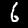
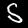
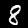

# AI / De la poésie

## Challenge
Debout dans l'allée, un homme singulier regarde fixement l'imposante horloge qui, d'un vert canard, plonge la rangée de livres dans une ambiance bucolique très agréable. Perturbé par cette étrange figure, vous n'avez même pas remarqué que quelqu'un s'était rapproché de vous.

« Ne faites pas attention à lui, dit la figure à moitié cachée par l'ombre d'une rangée de livres. Il cherche de l'inspiration pour son nouveau poème, et depuis quelque temps, il est fasciné par les chiffres. Je ne sais pas ce qu'il a fait, mais cela lui a complètement retourné le cerveau, il est devenu incompréhensible. »

La voix féminine laissa place à une grande dame à lunette ronde, elle tenait en main un livre fraichement imprimé.

« Vous le connaissez ?

— Bien sûr ! Nous nous échangeons nos poèmes pour les commenter et les améliorer, mais ces dernières semaines il ne me parle presque plus, et je ne comprends rien du tout à ce qu'il m'a donné ! Regardez ça. »

Elle vous tendit le livre pour que vous puissiez l'examiner. La couverture est toute simple, il y a seulement marqué le titre : Être pair ou ne pas l'être.

Cependant, en l'ouvrant, vous vous rendez compte que ce n'est pas un livre, mais une collection d'images ! Christelle remarqua votre mine stupéfaite et ajouta :

« C'est ce que je vous disais, ce n'est pas de la poésie à ce que je sache. »

D'abord étonné, vous devenez curieux et pensif, qu'est-ce que cela peut-il bien-être ? Après quelques secondes passées à feuilleter l'ouvrage, vous vous exclamez :

«Bien sûr !

— Comment ça ? Vous avez une idée de ce que cela peut être ?

— Je pense oui, je crois bien pouvoir le déchiffrer. »

## Inputs
- sample of handwritten single digit images: [poeme.zip](./poeme.zip)


## Solution
We have a set of 6536 handwritten single digit images, like in the `MNIST`database:

   

So we have to use a neural network to help and decode those images. I used the code shared in https://machinelearningmastery.com/how-to-develop-a-convolutional-neural-network-from-scratch-for-mnist-handwritten-digit-classification/. It provides various models for `MNIST`. I used the `deeper CNN` model, because why not.

```python
# From https://machinelearningmastery.com/how-to-develop-a-convolutional-neural-network-from-scratch-for-mnist-handwritten-digit-classification/
# define cnn model
def define_model():
    model = Sequential()
    model.add(Conv2D(32, (3, 3), activation='relu', kernel_initializer='he_uniform', input_shape=(28, 28, 1)))
    model.add(MaxPooling2D((2, 2)))
    model.add(Conv2D(64, (3, 3), activation='relu', kernel_initializer='he_uniform'))
    model.add(Conv2D(64, (3, 3), activation='relu', kernel_initializer='he_uniform'))
    model.add(MaxPooling2D((2, 2)))
    model.add(Flatten())
    model.add(Dense(100, activation='relu', kernel_initializer='he_uniform'))
    model.add(Dense(10, activation='softmax'))
    # compile model
    opt = SGD(learning_rate=0.01, momentum=0.9)
    model.compile(optimizer=opt, loss='categorical_crossentropy', metrics=['accuracy'])
    return model
```

What we have to do:
- Train the model on the `MNIST` database
- Save the model in a file
- Load the model and run it on each sample image to get a prediction
- Save the predicted digits in an output file

Training the model on the `MNIST`database and saving it to a file is done using following:

```python
# From https://machinelearningmastery.com/how-to-develop-a-convolutional-neural-network-from-scratch-for-mnist-handwritten-digit-classification/
def save_model():
    # load dataset
    trainX, trainY, testX, testY = load_dataset()
    # prepare pixel data
    trainX, testX = prep_pixels(trainX, testX)
    # define model
    model = define_model()
    # fit model
    model.fit(trainX, trainY, epochs=10, batch_size=32, verbose=0)
    # save model
    model.save('final_model.h5')
```

Getting a prediction for a sample image is done as follow:

```python
# https://machinelearningmastery.com/how-to-develop-a-convolutional-neural-network-from-scratch-for-mnist-handwritten-digit-classification/
# load and prepare the image
def load_image(filename):
    # load the image
    img = load_img(filename, grayscale=True, target_size=(28, 28))
    # convert to array
    img = img_to_array(img)
    # reshape into a single sample with 1 channel
    img = img.reshape(1, 28, 28, 1)
    # prepare pixel data
    img = img.astype('float32')
    img = img / 255.0
    return img

# load an image and predict the class
# From https://machinelearningmastery.com/how-to-develop-a-convolutional-neural-network-from-scratch-for-mnist-handwritten-digit-classification/
def predict(filename, model):
    # load the image
    img = load_image(filename)
    # predict the class
    predict_value = model.predict(img)
    digit = argmax(predict_value)
    return digit
```

Running a prediction on each image of the sample set is done as follow. Predictions are stored in `predictions.txt`:

```python
# run prediction on every sample image, write output to 'predictions.txt'
def run(model):
    # open file output
    with open("predictions.txt", "w") as f:
        # Do a prediction on each image set
        for i in range(6536):
            image = "images/" + str(i) + ".jpg"
            digit = predict(image, model)
            f.write(str(digit))
```

Here's what we get:

```console
$ cat predictions.txt
65806165639121042971467001964507867008426159442809908441035892436599841202106284439037518537216320102622259851744176430942360640031766488936680565974415601682026116196885582581455127002331834207372612253067052484129066665834070419829354025676600826384338076972920261985577873233432158910923566981689891628872604867320524259239732376517467970166803088846574370007928443861028484113473041927643819223856698204847544707411013926155270803129467354288555076900267112070499061218404303887662165091782312395294626540624453441866990616502782200869350676435437622982080299668050512797649954875861211226686387847202788411417774997449849712740665080402390598683382529809026084631804502165997443360392210286203780588895281870616066629318257251802258012040269986091237200898339007203534898275054497780643152961424231102128310236540541782842050548924201762584953077681454773085729392100403040420110929287992149875948174373658461984987245644088651409386390678649642000592682145321194075322718878739445480287855850180176313781534307235561068976993389967536835382778670042447196204657055378999258961752290667246660570192523922607275291866396626565780524499056890514096125138439603853826848945661894026433324944352333981528811577094000391465102725920283806240315653027785953871318814992648383966159051049436315645362727760829480026570060387386035633248196990144327100124433825672950955081976944693964972626505009206201077305630652608081507589653853792552548581523510837946552212624482110203003831112653418604320886619043668914054584186420633655466516206300508862433563764736362329148703845057240644745463880835201249758534452565750459877527624298044665746543297679140914605145767159657304528518290908340420661108300412026407708372697411930970728721334453029022420239268928130814821448262716288365169310473900758076337682645492220252386961268289382289219120788614204007341672617697114913230785570690289420482435027082168646235816806374470785390187095746780114614327752475029226046958654028720111717436898551254443710767833249606358674367912271844250506384993105930101205000208138090209524549405220086919838825332054419642616399817243148829037741056991702662166444485035696870804009742534259453510178115275338742225082448611924062184866493408016512199283958055461413488444367469423170015439192598746501916454419324334890668489124431657614442712400105966557235988348532322949921518491780174494998666160666237856234130993629518865413181236538726551545603457705064175434321782964677227810139467184601610636562608772351705594125899546780252444021169148055621090076060689148720673439516573454381928472699679680952210386548048037465500954531749341332877169424856022808354085841707368692680285768661295259728133247382589316058504262776735345978901053548768852068007322449697201722310855661522405633252438717445287582161237504752256446285530209091743018616295363945199877859562270040865914046259166508390599907325454473623494577874685158904491843210422949806118429001019372873441402509941211454602132058761152583691340928176452384781324881686644894336100160062017265810590713265746073053457790553427823560165487660848239803224182062651844094916791463512671845291520040187264154169445811798831010620566840431467406218653903385422075605614359270949556254657825492559485700120020255403606198252904742428217725808734975961767649439811480170634325152724491163800390416144823478252886500930242345590018411066708994858540904246031887238513094842124868839406370538246327522147457967446550256701912212215220676834606660525169469442024211494908502462437688676736153829578615869251962420147402423854014900022370666181918898249668266916545043181377431927430339467422184000039920646376553563596389893140308818660663387567277606616376555829308777653205016197061848168484271005212717070808384804411068324918113163383205255128340190078960865896805166142898440643122952215297196330719241950128669002866510881047541065815285690956753064366608007918204430404607904605479419342771249180901594666476964560843525784581235657862756204326940680451502842196351149576414251903004152850520522080415037640318098186344424497873879316322301987561897651512954342127974836435461036406383229263276251189098771029363710607453785256616813773744422047828886679906168956965229024640174406365301778215166332296135881456094613803858139405385758926479045210698208409542563415031126972441587925575033344362790852988166246883540454098428683166263217697526416288865374602017071992135054305996658405606842972695487108601299056276353249287566583642698546140427143960723049626622915684921116567469485596154377123589021697168116590878129700687073741656957344460322404833205348332957947129134413769084052068887948609031165894296482463178400237388928514926727743770219727882118070745781709279140844799647722163932668438920103826643322203017320766890060661989412055699136791412181592632865068024530396824300571613816006958917983749383459879098134832986546844035862698652884027984984891837554776519445502053469622026515265787332543297100566610266429156560073649230955081625156238211047852840783060912441409255156495450442784240299289426492693563905288815207438173076187950092835263856634622087942142875685698036884401528890611293390590735664526024215329224336236963589901491540482995861144105592086090100164165609910141033302194159096605748549025262404558044107712475271908514370038723715436085048200715826687765911875341254993081202326228253423849154322109312002415895538359845721782545633926124436084001183126279625872892224487726506437746180534080763118008235609250316204907114147047802644533643141576169279740380830864425303126659465832694028880734782423504280857058847880419850169888142651044526402661314904078646668485812867363204611206826390360658264752989672027666532639136770198430448576073212713558106572822352948636311952939884086338464801504358583641540318049655823090321337309130609430985850815881503909562695902656707012766998293416155354907602246392471693503030709751583848831085768284150751623258744009182594558914907794604461104062395069866390904217698496138795264398277255553498666527860067870874142868334557135345884297033412916254320502446071011512333401069941007051621536936520387929150491244892190372084104880467952162638462249645580615801498696808849936643079101612172408365732434453781264276260087540162887807936336962007980585035983416319629885706363069428442118416047106761007648866754207887161391457091182056282681192786077025832530956989118628677344116610264223621338839218238792229169385953415679240512468307178637485242028560645289781137691252470158156485102907835922612319876362568428
```

Finally we need to parse this data. We have 6536 images, giving us 6536 digits. The challenge description gives us a `hint about odd/even digits`, suggesting that each digit shall be converted to a bit. Now 6536 bits gives us exactly 817 bytes, which in term should give us the poetry. That's what we do in the following:

```python
def parse():
    b = ''
    with open("predictions.txt", "r") as f:
        digits = f.read().strip()
        # Parse digits: even=0, odd=1
        for c in digits:
            digit = int(c)
            if digit % 2 == 0:
                b += '0'
            else:
                b += '1'
        # Parse binary to get bytes/characters
        bytes_ = wrap(b, 8)
        text = ''.join([chr(int(b, 2)) for b in bytes_])
        return text
```

And here's the decoded poetry, and the flag!

```
$ python3 sol.py
Etre pair ou ne pas lettre

L’homme, dont la vie entière
Est de 96 ans,
Dort le 1/3 de sa carrière,
C'est juste 32 ans.Ajoutons pour maladies,
Procès, voyages, accidents
Au moins 1/4 de la vie,
C'est encore 2 fois 12 ans.

Par jour 2 heures d'études
Ou de travaux - fonô 8 ans,
Noirs chagrins, inquiétudes
Pour le double font 16 ans.Pour affaires qu'on projette
1/2-heure, - encore 2 ans.
5/4 d'heures de toilette
Barbe et caetera - 5 ans.

Par jour pour manger et boire
2 font bien 8 ans.
Cela porte le mémoire
Jusqu'à 95 ans.Reste encore 1 an pour faire
Ce qu'oiseaux font au printemps.
Par jour l'homme a donc sur terre
1/4 d'heure de bon temps.
Juste assez pour déposer le drapeau sur le 404CTF :
404CTF{d3_L4_p03S1e_qU3lqU3_P3u_C0nT3mp0r4in3}

Poème original : Le quart d'heure de bon temps Nicolas Boilequ
```

## Python code
Complete solution in [sol.py](./sol.py)

## Flag
404CTF{d3_L4_p03S1e_qU3lqU3_P3u_C0nT3mp0r4in3}
