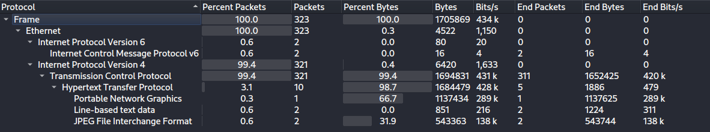
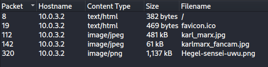
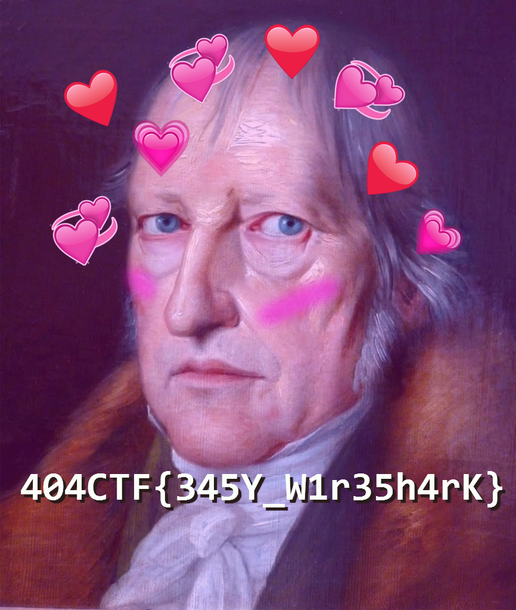

# Forensics / Pêche au livre

## Challenge
Etant tranquillement assis au café littéraire, vous entendez Albert Camus discuter avec quelqu'un d'autre.

Vous comprenez qu'après avoir écrit son dernier livre, il s'interroge sur l'actualité du monde littéraire. Il fait donc des recherches sur ses homologues écrivains et plus particulièrement sur Simone Weil, dont il a beaucoup entendu parlé ces derniers jours, et se demande quel sera le sujet de son prochain livre...

Justement, vous avez récemment intercepté des communications de Simone Weil, peut être pourrez vous trouver le sujet de son prochain ouvrage.

## Inputs
- PCAP file:  [Capture.pcapng](./Capture.pcapng)

## Solution
We open the `PCAP` file in `Wireshark`, glance at the protocol hierarchies, notice some HTTP traffic and some JPEG files, which can be exported with `File / Export Objects / HTTP`. We end up with three images, one of them giving us the flag.

## Flag
404CTF{345Y_W1r35h4rK}
