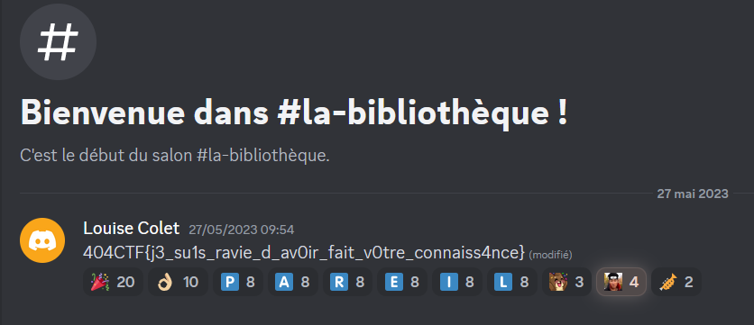

# OSINT / L'âme d'un poète et le coeur d'une femme [4/4]

## Challenge
« Je vous remercie pour l'invitation ! Avez-vous pu vous en procurer une ? J'ai entendu dire que Mme Colet tenait ce salon pour permettre à des personnes talentueuse de se rencontrer. Je suis sûre qu'elle sera ravie de faire votre connaissance, vos talents ne sont plus à démontrer. Peut-être qu'en répondant à ses questions, vous pourrez obtenir un cadeau de sa part ? »

Obtenir un cadeau de la part de Louise Colet

## Solution
We found the `Discord` server at the previous step: https://discord.gg/NeCgh9ZZqD

Heading to that `Discord` server, we go through multiple threads and get asked various questions on French litterature, before being granted with the flag:

## Flag
404CTF{j3_su1s_ravie_d_av0ir_fait_v0tre_connaiss4nce}
