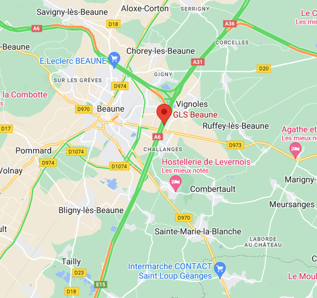
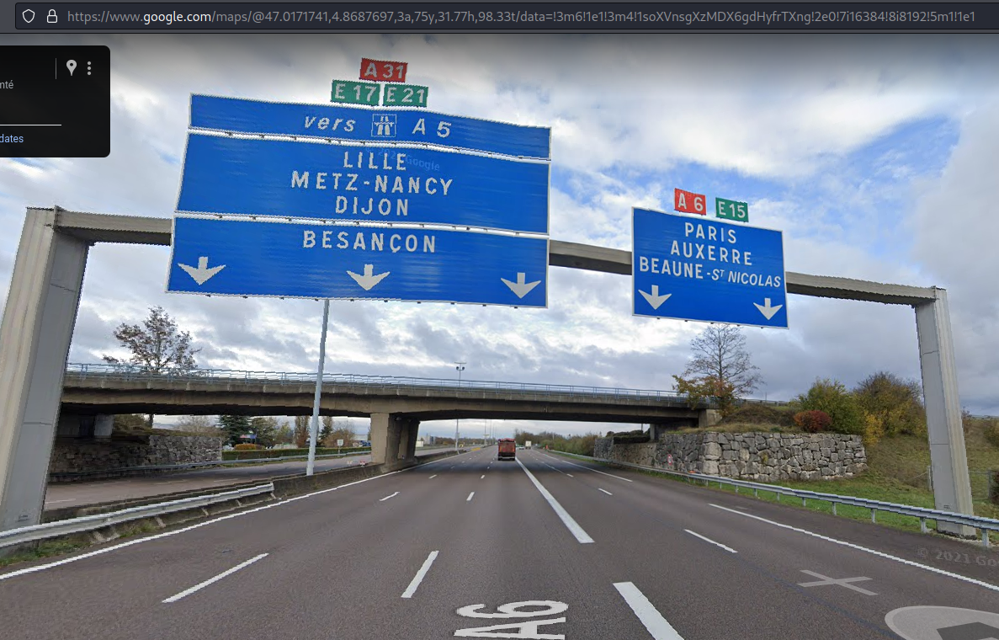

# OSINT / Le Tour de France

## Challenge
En flânant entre les tables du Procope, vous entendez une voix qui vous est familière. C'est Phileas Fogg qui s'est mis en tête de faire le tour du monde en 80 jours et il cherche des acolytes pour son voyage. Évidemment, il ne veut pas prendre le premier venu et a mis en place une épreuve d'entrée pour vérifier que vous savez vous retrouver grâce aux outils à disposition. Le rejoindre ne pourrait être qu'une expérience enrichissante pour vous, ce gentleman a beaucoup à vous apprendre!

> Trouvez la position exacte des panneaux.

## Inputs

## Solution
On this picture, we're on E15, near Beaune, close to the point were the highway splits to Paris via A6 and Lille via A5:

We find the exact location in `Street View` in Maps, for instance:

Now we have the exact location of the indications: https://www.google.com/maps/@47.0171741,4.8687697

Rounding it to two digits gives us 47.02,4.87 and the flag 404CTF{47.02,4.87}.

## Flag
404CTF{47.02,4.87}
