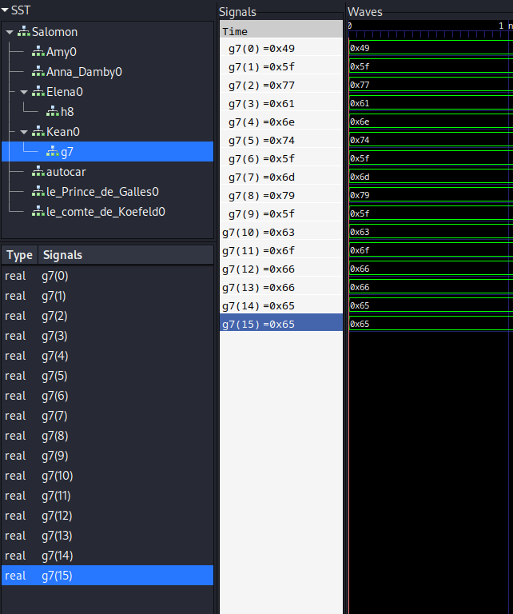
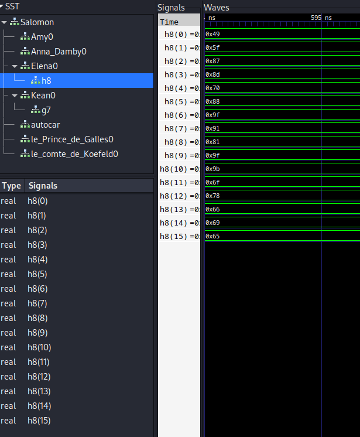
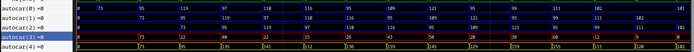

# Secu Hardware / A la trace

## Challenge
Votre regard s'attarde sur un coin reculé du bar. Vous voyez un homme qui a l'air nerveux. Vous vous dirigez alors vers lui pour vous enquérir de la situation.

« Bonjour, je n'ai pas le plaisir de vous connaître, puis-je vous demander qui vous êtes ? »

L'homme se retourne et rétorque :

« Et bien, bonjour... Je me prénome Camus, Albert Camus.

— Pardonnez moi mais, vous me semblez nerveux.

— Excusez, moi. J'ai peut être semblé impoli. La verité c'est que j'attend mon café depuis 4h maintenant.

— Mais que se passe-t-il ?

— On m'a dit que cet étrange énergumène de Jean Paul SAT était parti avec la machine à café ! Dites, vous voulez pas vous rendre utile ?

— Et bien ma foi, pourquoi pas ?

— Rendez vous à cette addresse, et tentez de rentrer chez lui. Je suis certain qu'elle est là bas. Cependant je n'ai jamais réussi à ouvrir sa serrure éléctronique. »

Il vous tend un petit papier.

« J'avais récupéré ça dans son portefeuille, je suis certain qu'il s'agit du mot de passe chiffré. Bonne chance. »

    Voici les données du papier : 49 b7 71 9f 90 cc 74 9f ca a4 64 b9 83 7a 9e 5e

Vous vous dirigez alors vers la maison de Jean-Paul SAT. En effet une drôle de serrure protège la porte.

Vous décidez de mettre vos compétences en sécurité materielle à profit. Tout d'abord, vous entrez un mot de passe erroné, I_want_my_coffee. Vous en profitez pour récupérer les traces des signaux éléctriques internes.

Vous êtes convaincu que cela devrait pouvoir suffir à déterminer l'algorithme interne de la serrure, et ainsi déchiffrer le mot de passe.

    Format : 404CTF{mot de passe}

## Inputs
- VCD file: [Trace_Me_In.vcd](./Trace_Me_In.vcd)
- sequence: 49 b7 71 9f 90 cc 74 9f ca a4 64 b9 83 7a 9e 5e

## Solution
Opening the vcd file in `gtkwave`, we can find two interesting signals `Elena0 / h8` and `Kean0 / g7` with length 16, just like the length of the sequence on the paper:

```
- g7: 49 5f 77 61 6e 74 5f 6d 79 5f 63 6f 66 66 65 65
- h8: 49 5f 87 8d 70 88 9f 91 81 9f 9b 6f 78 66 69 65
```




The first one `g7` happen to be the wrong input that was entered `I_want_my_coffee`:

```console
$ python3
Python 3.11.2 (main, Mar 13 2023, 12:18:29) [GCC 12.2.0] on linux
Type "help", "copyright", "credits" or "license" for more information.
>>> l = [0x49, 0x5f, 0x77, 0x61, 0x6e, 0x74, 0x5f, 0x6d, 0x79, 0x5f, 0x63, 0x6f, 0x66, 0x66, 0x65, 0x65]
>>> ''.join([chr(c) for c in l])
'I_want_my_coffee'
```

So the second one `h8` must be the encrypted version. If we can find how to convert the first into the second, then we can revert the internal algorithm and decrypt the provided sequence.

Looking into the other signals, we find the following:



This is showing how the algorithm is implemented:
- taking two consecutive values from the plaintext,
- xor them together,
- then add the second value

So the algorithm is essentially: `ct[i] = pt[i-1] ^ pt[i] + pt[i]`, which can be implemented like below in python. We also verify that we get the `h8` sequence when encrypting `I_want_my_coffee`:

```python
def encrypt(pt):
    rshift_1 = [0x00] + pt
    rshift_2 = [0x00] + rshift_1
    #print('pwd:', pt)

    xor = [a^b for (a,b) in zip(rshift_1, rshift_2)]
    #print('xor:', xor)

    ct = [(a+b) for (a,b) in zip(xor, rshift_2)][1:]
    #print('ct: ', ct)
    return ct

# Wrong paintext password
password = [0x49, 0x5f, 0x77, 0x61, 0x6e, 0x74, 0x5f, 0x6d, 0x79, 0x5f, 0x63, 0x6f, 0x66, 0x66, 0x65, 0x65]
print('Wrong password:')
print('PT:', ''.join([chr(c) for c in password]))
ct = encrypt(password)
print('CT:', ct)

# Ciphered password h8
h8 = [0x49, 0x5f, 0x87, 0x8d, 0x70, 0x88, 0x9f, 0x91, 0x81, 0x9f, 0x9b, 0x6f, 0x78, 0x66, 0x69, 0x65]
print('h8:', h8)
if ct == h8:
    print('Encryption match with h8!')
```

```console
$ python3 sol.py
Wrong password:
PT: I_want_my_coffee
CT: [73, 95, 135, 141, 112, 136, 159, 145, 129, 159, 155, 111, 120, 102, 105, 101]
h8: [73, 95, 135, 141, 112, 136, 159, 145, 129, 159, 155, 111, 120, 102, 105, 101]
Encryption match with h8!
```

We revert the algorithm to decrypt the ciphered password `h7` and retrieve the password `I'm_n0t_4Dd1ct^^`:

```python
def decrypt(ct):
    pt = ct[:2]; rshift_1 = [0x00] + pt
    l = len(ct)
    for i in range(2,l):
        x = (ct[i] - rshift_1[i])
        c = (rshift_1[i] ^ x)%128
        pt.append(c); rshift_1.append(c)
    return pt
```

```console
$ python3 sol.py
Wrong password:
PT: I_want_my_coffee
CT: [73, 95, 135, 141, 112, 136, 159, 145, 129, 159, 155, 111, 120, 102, 105, 101]
h8: [73, 95, 135, 141, 112, 136, 159, 145, 129, 159, 155, 111, 120, 102, 105, 101]
Encryption match with h8!

Encrypted password:
CT [73, 183, 113, 159, 144, 204, 116, 159, 202, 164, 100, 185, 131, 122, 158, 94]
pt [73, 39, 109, 95, 110, 48, 116, 95, 52, 68, 100, 49, 99, 116, 94, 94]
ct [73, 183, 113, 159, 144, 204, 116, 159, 202, 164, 100, 185, 131, 122, 158, 94]
Encryption match with g7!
I'm_n0t_4Dd1ct^^
```

## Python code
Complete solution in [sol.py](./sol.py)

## Flag
404CTF{I'm_n0t_4Dd1ct^^`}
