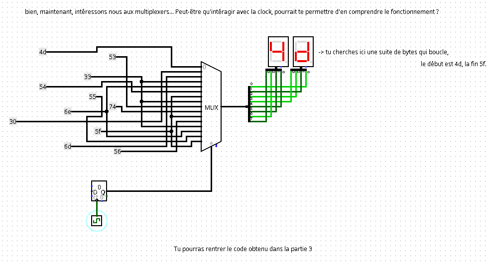

# Secu Hardware / Un courrier suspect

## Challenge
Vous commencez à profiter de la vue offerte par ce café pittoresque ainsi que de vos premières gorgées de café quand vous sentez une présence derrière vous.

« Bienvenue, novice. Moi c'est Jean Paul Sartre, mais on m'appelle plutôt Jean Paul Sat par ici. »

À peine avez vous eu le temps de vous retourner, que cet individu vous met dans les mains une platine sur laquelle figure un circuit. Il vous tend également une petite feuille, qui parle d'un "test de remise à niveau".

« Et voici les instructions. »

Il vous regarde avec insistance.

## Inputs
- Logisim file: [bienvenue.circ](./bienvenue.circ)

## Solution
We open the file using `Logisim` and open the differet parts.

Part 1 gives us the beginning of the flag: `404CTF{L3_`

Part 2 gives shows a clock, a mutiplexer and two hexadecimal digit displays. Activating the clock generates this sequence of bytes: `4d 30 6d 33 6e 54 5f 33 53 74 5f 56 33 6e 55 5f`, to be used in part 3.

Part 3 shows a clock, a read-only memory and a tty. Entering the sequence of bytes in the rom and activating the clock displays the sequence of bytes in the tty as a newt part of the flag: `M0m3nT_3St_V3nU_`.

Part 4 again shows a multiplexer and hex-digit displays, but circuit `blackbox` at the end of the multiplexer is an `AND 00`, so it prevents the output to be displayed: removing it completely fixes the issue and we get the following sequence of bytes by activating the clock: `44 33 5f 35 34 6d 75 73 33 72 7d 00`.

We input this sequence in part 3's rom to display it on tty and get the rest of the flag: `D3_54mus3r}`.

## Flag
404CTF{L3_M0m3nT_3St_V3nU_D3_54mus3r}
