# Secu Hardware / Un réveil difficile

## Challenge

## Inputs
- Circuit file: [reveil.circ](./reveil.circ)

## Solution
We have a circuit with two read-only memorues, feading two multiplexers, which outputs are combined to feed a `blackbox`. The `blackbox` itself also takes some input and its output is injected in four `7-segment displays`.

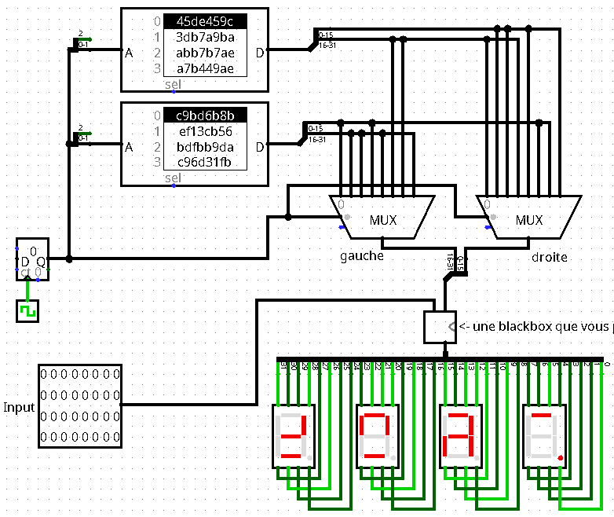

The `blackbox` implements some function (a `XOR` actually) with just `NAND` gates. There's also an indication about `involutive` gates:

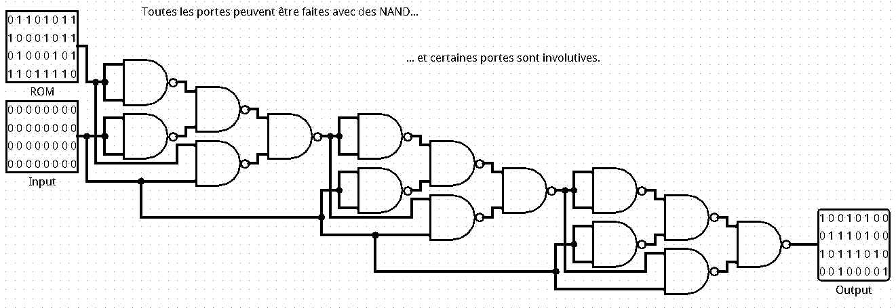

The goal is to find some `input` that leads to display `Un_c` somehow in the `7-segment displays`.

### Manual approach
We can directly change the input's individual bits so that `Un_c` is eventually displayed. We count value 0, this happens with `input = 11001010111111101011111010101101`:

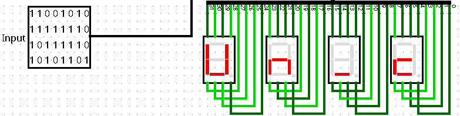

Now, activating the clock, gives us the rest of the message:

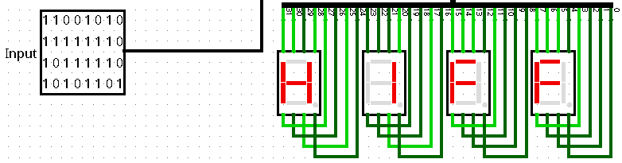
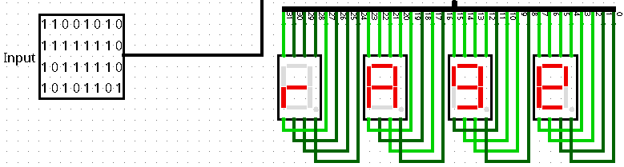
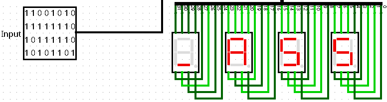
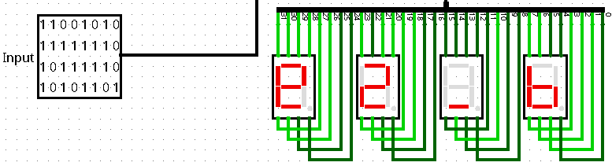
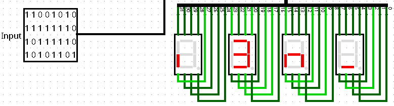
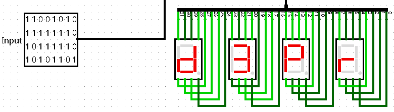
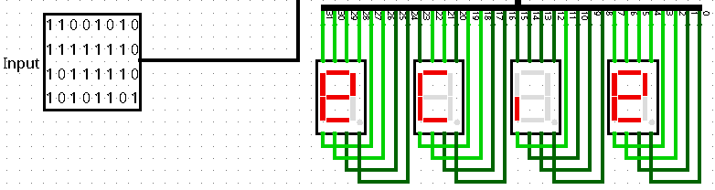

Now, with the indication about ambiguous characters, we get this message: `Un_cH1FFrA9e_A55e2_bi3n_d3PreCie`, hence the flag.

### Automatic approach
For more fun, we could also implement the circuit in python and automatically find the expected input. For that, we need to implement the MUX, the `blackbox`, and the expected input to the `7-segment displays`.

Regarding the MUX:
```python
# ROMs
A = 2 * [0x45de459c, 0x3db7a9ba, 0xabb7b7ae, 0xa7b449ae]
B = 2 * [0xc9bd6b8b, 0xef13cb56, 0xbdfbb9da, 0xc96d31fb]

# Left / Right MUX and combined output
L = [low(B[0]), high(B[1]), high(B[2]), low(B[3]), high(B[4]), high(A[5]), high(A[6]), high(B[7])]
R = [high(A[0]), low(A[1]), low(A[2]), high(A[3]), low(A[4]), low(B[5]), low(B[6]), low(A[7])]
M = [(l << 16) | r for (l, r) in zip(L, R)]
```

Regarding the `blackbox`(it's just a `XOR`, but oh well...):
```python
def blackbox(r, i):
    d1 = nand(r,r); d2 = nand(i,i); d3 = nand(d1,d2); d4 = nand(r,i); d5 = nand(d3,d4)
    b1 = nand(nand(d1,d2),d4)
    b2 = nand(nand(nand(b1,b1),nand(i,i)),nand(b1,i))
    b3 = nand(nand(nand(b2,b2),nand(i,i)),nand(b2,i))
    return b3
```

Regarding expected value `Un_c` to be displayed, heading to http://www.cburch.com/logisim/docs/2.3.0/libs/io/7seg.html, here's is how the `7-segment display` behaves in `Logisim`:

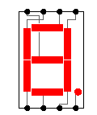

So the four characters `U`, `n`, `_` and `c`, are encoded as follow:
```
python
# Expected output: Un_c
un_c_l = [0b01011110, 0b10001010, 0b00000100, 0b10001100]
un_c = (un_c_l[0] << 24) | (un_c_l[1] << 16) |(un_c_l[2] << 8) | (un_c_l[3])
```

Last piece, the `blackbox` is involutive, meaning that its reverse is itself. So to get input `i`, we simply apply it to the expected output `un_c`. We do so for each counter value:
```python
for count in range(N):
    i = circuit(count, un_c)
    print(count, '{:032b}'.format(i))
```

The execution provides us with the input expected to display `Un_c` for each counter value:
```python
$ python3 sol.py
0 11001010111111101011111010101101
1 01001110011001100101001011001001
2 00011100100011100100110011011101
3 10010000100011100101110011000111
4 01101000110010001011111011101111
5 10011100110000100011000000100101
6 00001010110000100100001010101001
7 01101000000110001011001011011101
```

The first value, we already found manually. Again, activating the clock, gives us the rest of the message: `Un_cH1FFrA9e_A55e2_bi3n_d3PreCie`.

## Python code (automatic approach)
Complete solution in [sol.py](./sol.py)

## Flag
404CTF{Un_cH1FFrA9e_A55e2_bi3n_d3PreCie}
